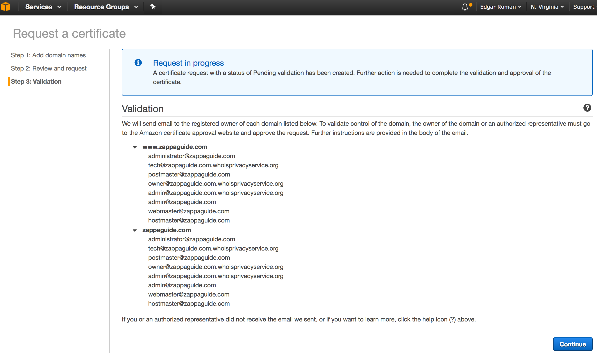
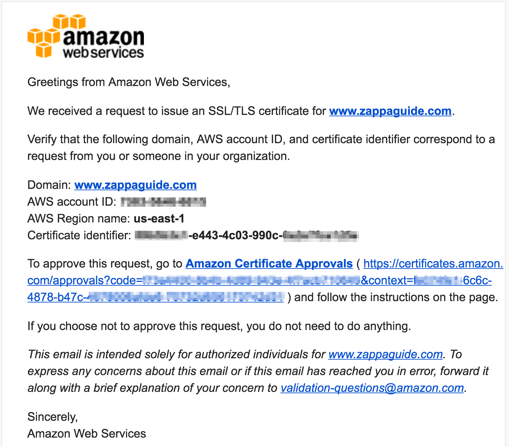
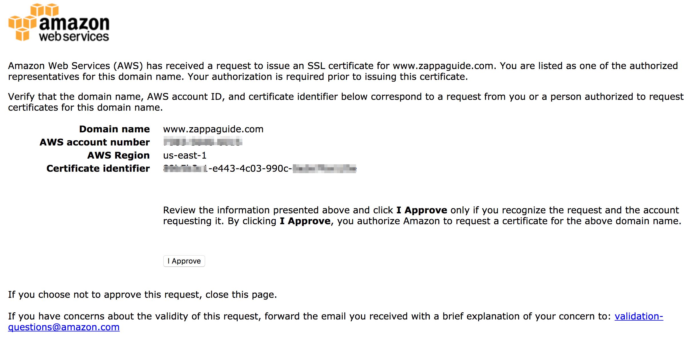
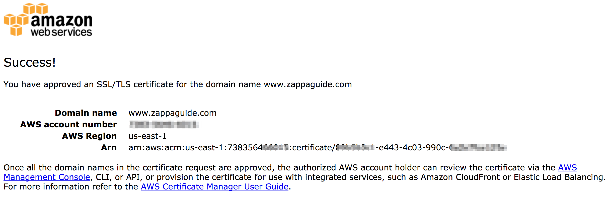

# AWS Certificate Manager (ACM)

This page lists various activites that may be necessary to perform when leveraging Zappa

## Request a Certificate

ACM provides digital certificates for free but the certificates can only be used with [Elasic Load Balancing and Amazon CloudFront](https://docs.aws.amazon.com/console/acm/supported-services).

!!! Warning
    To use ACM with Zappa, you must create or import the certificate in the US East (N. Virginia) (us-east-1).  See [AWS documentation](http://docs.aws.amazon.com/apigateway/latest/developerguide/how-to-custom-domains.html#how-to-custom-domains-prerequisites) for more details.

 1. Navigate to the [ACM Console](https://console.aws.amazon.com/acm/) and click `Request a Certificate`
 2. In 'Add a Domain name' enter 
 

    Note that we entered both the 'www' subdomain and the *apex* of the domain.  This allows users to leverage either url and have it covered with a single certificate.  More info can be found in the AWS ACM documentation on [Requesting a Certificate](http://docs.aws.amazon.com/acm/latest/userguide/gs-acm-request.html)

    !!! Warning
        Carefully consider which domains shall be covered by this certificate because once it is validated, you cannot modify the list of domains.  Any changes will require a new certificate to be issued.

 3. Select validation method
    ACM needs a way to confirm that you own the domain.  So you must select either [DNS Validation](https://docs.aws.amazon.com/acm/latest/userguide/gs-acm-validate-dns.html) 
    or [Email validation](https://docs.aws.amazon.com/console/acm/validate-email). 

 4. Click on Review and Request

    You should see a confirmation message similar to the image below 
    (showing email validation):
    

 4. Email validation

    If you chose email method of domain ownership validation, an email is sent to the registered contact address in the WHOIS for the domain.  
    In addition, a few select email addresses are also included.  Full [validation rules](https://docs.aws.amazon.com/acm/latest/userguide/gs-acm-validate-email.html) are posted in ACM Documentation.

    1. Check your email for validation links

        You should receive at least one email for each domain you entered.  You may actually get multiple email addresses because sometimes registered emails are duplicated for Techincal or Administrative contacts in the WHOIS information.  The emails should be similar to:
        

    2. Click on all the validation links

        **You must click on the validation link for every domain name included in step 2 above**.  The digital certificate will not be issued until all domains have been verified.
        
        And then:
        

 6. Record the ARN for the digital certificate

    You will use the ARN for other purposes.  The ARN is displayed on the verification page but also in the details page for the certificate in the ACM console.
