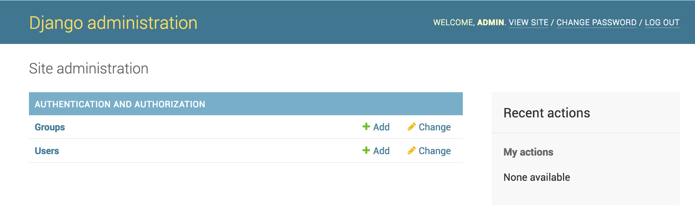

# Using a Database

This walkthough documents the steps necessary to connect your application to a hosted database.

## Prerequisites

This walkthough requires the [Core Django Setup](walk_core.md) to be completed.  Also, it is important 
to have your network setup properly so check out [Adventures in Networking](aws_network.md).  

We will assume you have chosen the VPC pattern: "VPC with a Public subnet and Private subnet"
But basically you will need the private subnet or subnets which can access the database.

## Options for Databases

### Use AWS RDS

This is probably the easiest to get up and running.  AWS takes care of the messy details of managing the host and provides database-as-a-service (if that's a real thing).  In addition, AWS RDS supports mySQL and PostGreSQL, both which are highly compatible with Django.  

### Host Your Own

Of course you can be running any type of database on an EC2 instance of your choosing.  Usually an EC2 instance will be associated with one subnet, but it is possible to have multiple IP addresses in different subnets for redundancy.

### Use another DB Service

There as some other database services such as DynamoDB.  Depending on the capabilities of the service, you may or may need the subnet information.  

## Provision your RDS Database in AWS

We'll just focus on the RDS case for this walkthough.  In fact we'll go through the walkthough using PostGreSQL.

So zip on over to [Creating an RDS Database](aws_database.md) and set up one.  You should record some key information we'll need here:

* The subnets (there should be at least two) in which we can access the database
* The endpoint (hostname) of the database and the port
* The username and password for the root user

### Configure RDS security group

By default newly created RDS Security Groups [have no inbound access](http://docs.aws.amazon.com/AmazonRDS/latest/UserGuide/Overview.RDSSecurityGroups.html).  So you need
to make sure your RDS Security group has open TCP connections from your subnets associated with the lambdas.  

So your inbound rules on the RDS security may look like:

Type | Protocol | Port Range | Source
----- | ----- | ----- | -----
All TCP|TCP|5432|sg9a9a1dfc

We open the whole range associated with the security group because when a lambda container is created, it could take any free address
in the subnet range.

### Summary Data

Note that at this point you don't yet have a database installed on your RDS instance.  So let's just pick a name we will use for the walkthough.  

Here is our sample data:

Parameter | Sample value
--------- | ------------
subnets | subnet-f3446aba, subnet-c5b8c79e
security group | sg9a9a1dfc
endpoint | zappa-db.crt239fsjdlk.us-east-1.rds.amazonaws.com
db username | administrator
db password | this_is_not_a_good_password
db name | zappadbname

## Setup your Configuration

### Edit requirements 

Note on PostGreSQL: because the psycopg2 library often involves compiling the library, I would suggest using the [Docker version of zappa](setup.md#approach-2-docker-with-zappa) to ensure you have isolation of environments and you don't mess up your local system.

Add this to your requirements.txt 
```sh
psycopg2
```

and then

```sh
pip install -r requirements.txt
```


### Django Settings

Add the above settings to your settings.py.  This is pretty standard Django db stuff.

```
DATABASES = {
    'default': {
        'ENGINE': 'django.db.backends.postgresql_psycopg2',
        'NAME': 'zappadbname',
        'USER': 'administrator',
        'PASSWORD': 'this_is_not_a_good_password',
        'HOST': 'zappa-db.crt239fsjdlk.us-east-1.rds.amazonaws.com',
        'PORT': '5432',
    }

}
```

### Zappa Settings

Now we add the VPC configuration to our Zappa settings file so that the lambda functions can connect to the database.

``` hl_lines="6 7 8 9"
{
    "dev": {
        "django_settings": "frankie.settings", 
        "s3_bucket": "zappatest-code",
        "aws_region": "us-east-1",
        "vpc_config" : {
            "SubnetIds": [ "subnet-f3446aba","subnet-c5b8c79e" ], // use the private subnet
            "SecurityGroupIds": [ "sg-9a9a1dfc" ]
        }
    }
}
```

## Create your Database

Ok, easy so far?  Yes!  All we had to do up to this point was carefully click a mouse in the AWS console and 
edit some text files.  Well fun time is over - now we run into some bootstrapping problems.  Fortunately, we only have to do this once each time we need a new database.

Turns out that when AWS creates a PostGreSQL RDS instance for you, it doesn't create a database.  So you have to do it yourself.  There are many options, but two methods could be:

1. Use a db tool on your local machine via a bastion host 
2. Use the AWS command line tool
2. Write some code to setup the database using zappa
2. Use the utility library [zappa-django-utils](https://github.com/Miserlou/zappa-django-utils)

Option 1 is easy if you have the db tool and the bastion host setup.  Option 4 is the easiest and quickest.  But let's explore how to do options two and three. 

!!! tip
    The quickest and easiest path is to use [zappa-django-utils](https://github.com/Miserlou/zappa-django-utils) - especially if you are using a PostGres database.  

    Many of the functions here are implemented without having to write any of your own code.

### Using AWS command line tool

You can only use the AWS command line tool to create the database if you are also creating the entire RDS instance.  Be sure to identify the database name to create with '[db-name](http://docs.aws.amazon.com/cli/latest/reference/rds/create-db-instance.html#options)'

Simply use the `aws` command tool using syntax similar to
[http://docs.aws.amazon.com/AmazonRDS/latest/UserGuide/USER_CreateInstance.html#USER_CreateInstance.CLI](http://docs.aws.amazon.com/AmazonRDS/latest/UserGuide/USER_CreateInstance.html#USER_CreateInstance.CLI)


### Setup the Database using zappa

Well, there is no easy way to get this done but here is a possible option: create a management command that can be run in the zappa environment.  

#### Create a management command in your Django Project

Follow these steps to create a management command environment (make sure your virtualenv is fired up)

```sh
cd frankie
python manage.py startapp axe
cd axe
mkdir management
cd management
touch __init__.py
mkdir commands
cd commands
touch __init__.py
```

Then create a file called `create_db.py`

```python
from psycopg2 import connect
from psycopg2.extensions import ISOLATION_LEVEL_AUTOCOMMIT
from django.core.management.base import BaseCommand, CommandError
from django.conf import settings

class Command(BaseCommand):
    help = 'Creates the initial database'

    def handle(self, *args, **options):
        self.stdout.write(self.style.SUCCESS('Starting db creation'))

        dbname = settings.DATABASES['default']['NAME']
        user = settings.DATABASES['default']['USER']
        password = settings.DATABASES['default']['PASSWORD']
        host = settings.DATABASES['default']['HOST']

        con = None
        con = connect(dbname='postgres', user=user, host = host, password=password)
        dbname = dbname
        con.set_isolation_level(ISOLATION_LEVEL_AUTOCOMMIT)
        cur = con.cursor()
        cur.execute('CREATE DATABASE ' + dbname)
        cur.close()
        con.close()
        
        self.stdout.write(self.style.SUCCESS('All Done'))
```
Then register app axe to settings.py and update files in aws using this command: zappa update dev.

#### Run the management command

```sh
zappa manage dev create_db
```

If all goes well, then your database should be created.

## Init the Database

At this point you should have an empty database ready for your Django application to fill up with schema. If this were a traditional server, you would merely run the `migrate` command.  But you can't because there is no command line.  Thus we have to modify them to adjust to the new environment.

So create your migrations and push the updated code.  

```sh
python manage.py makemigrations
zappa update dev
```
Now you invoke the zappa manage command:

```sh
zappa manage dev migrate
```

And repeat this process every time you make model changes.

## Create your Django superuser

The Django management commands were meant to be run interactively on a command line on a traditional server.  Because there is no command line with lambda, we must do some trickery to get around the input needed for the Django createsuperuser management command.

Essentially we will use the `raw` flag on the invoke command to just run raw python.  The following command creates a new superuser named 'admin' with email 'admin@yourdomain.com' and password of 'horse battery stapler'

```sh
zappa invoke --raw dev "from django.contrib.auth.models import User; User.objects.create_superuser('admin', 'admin@yourdomain.com', 'horse battery stapler')"
```

Additional superusers can be added via this method or the Django admin console.

## Test and profit

At this point you should be able to log into your Django admin:



(http://marcelog.github.io/articles/aws_lambda_internet_vpc.html)

[https://www.isc.upenn.edu/accessing-mysql-databases-aws-python-lambda-function]

# Further Topics

## Security

Notice that we are using the master user credentials for the RDS system.  It would be more secure if we created a dedicated user that can only access the relevant database.  More information on that can be found here:
[https://www.digitalocean.com/community/tutorials/how-to-use-postgresql-with-your-django-application-on-ubuntu-14-04](https://www.digitalocean.com/community/tutorials/how-to-use-postgresql-with-your-django-application-on-ubuntu-14-04)

You will have to modify your custom Django management command to accommodate creation of a new user.

## SQLite issues with Python 3

While not a hosted service, SQLite often has a lot of value to the Django developer.  There is currently an issue with the AWS Linux Image that uses Python 3 - it does not include the SQLite python connector and thus Django cannot use the SQLite database backend.  This issue is fixed by [lambda-packages](https://github.com/Miserlou/lambda-packages/commit/f44533297e3a3c5a7ba8885f6b88a3fb1cc4cfd8) which zappa automatically detects and fixes.  However, the lambda-docker project reflects the AWS lambda environment and does not include SQLite.

The recommended solution until AWS Linux Image is updated is:
   * Download and uncompress the `_sqlite.so` from [https://github.com/Miserlou/lambda-packages/files/1425358/_sqlite3.so.zip](https://github.com/Miserlou/lambda-packages/files/1425358/_sqlite3.so.zip)
   * Place this file in the root of your zappa project
   * Add an `"exclude" : ["_sqlite.so"]` to your `zappa_settings.json` so that it is not unnecessarily included when you deploy your zappa app 

With this you should be able to use SQLite with both your lambda-docker environment and lambda deployments.

## Additional References

For MySQL tips:
[https://www.digitalocean.com/community/tutorials/how-to-use-postgresql-with-your-django-application-on-ubuntu-14-04](https://www.digitalocean.com/community/tutorials/how-to-use-postgresql-with-your-django-application-on-ubuntu-14-04)