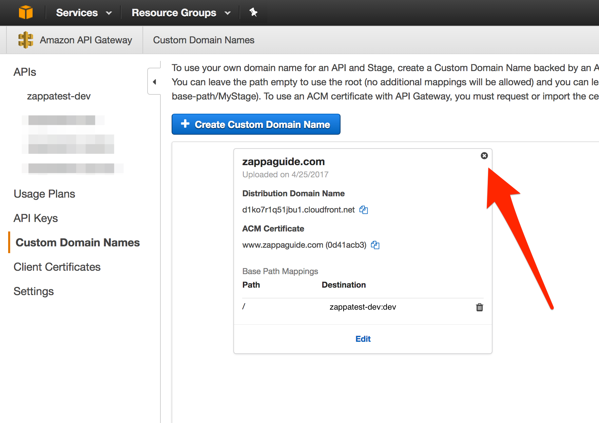

# Using a Custom Domain

If you've followed the walkthroughs thus far, you've at least created a working [Django site using Zappa](walk_core.md)
But the URL provided by Zappa is pretty darn ugly.  Not only does it use an apparent random domain name, but the Zappa environment is used as the path.  For example:

```
https://bnu0zcwezd.execute-api.us-east-1.amazonaws.com/dev/
        ^^^^^^^^^^^^^^^^^^^^^^                         ^^^
      Auto Generated API Gateway              Your Zappa Environment 
```

Ideally most sites would be something like:

```sh
https://www.zappaguide.com/
```

This is entirely possible with Zappa - so how do we get there?

## Let's talk about HTTPS

Perhaps you're wondering why we are introducting the concept of HTTPS when the topic of this walkthough is using a custom domain.  Zappa provides an automated way of creating the necessary custom domain mappings as a part of using encryption.  Thus many of the techiques described in this walkthough will ultimately end up with a custom domain along with HTTPS.  

In an effort to make the process straightforward, we are therefore bundling HTTPS as part of the walkthough.  Philosophical arguments for HTTPS are made [elsewhere](https://developers.google.com/web/fundamentals/security/encrypt-in-transit/why-https).  But with free services like "Let's Encrypt" and AWS Certificate Manner (free for API Gateways) there is no additional cost burden to leverage HTTPS certificates.

Note that we refer to HTTPS instead of SSL and or TLS where [appropriate](https://security.stackexchange.com/a/5127).

As a final note, if you are really opposed to encryption, or need unencrypted traffic for some reason, we will provide a method to accomplish this at the end of the walkthrough.

## Overview of the process

There are a number of services that are involved in this process:

 * **Domain Name Registrar** - Allows you to purchase and register domain names
 * **DNS Providers** - Allows you to host things online using that domain name
 * **Certificate Authority (CA)** - Provides encryption certifications to encrypt traffic for the site

Combined with Zappa, these services will all be used in this walkthrough.  Note that many companies and organizations can provide these services and some, like Amazon, can provide all three.

Ultimately, the AWS API Gateway will be associated with a new, dedicated CloudFront distribution that not only leverages the digital certificate to provide HTTPS, but also hides the Zappa environment path.  Finally, a DNS record will point to this new CloudFront Distro to complete the experience for the end user.

## Registering your Custom Domain

First you need a registered domain.  It doesn't matter who your domain registrar is as long as you have control over the name server records to point to a DNS provider.  Of all the services, this one is the most generic and almost any Registar will do.

Let's choose an example domain for this walkthrough:
```
www.zappaguide.com
```

## Choices

At this point, you have a registered domain name and a working Zappa deployment.  There are two options:

 1. [Use the built-in Zappa commands](#using-the-built-in-zappa-commands) 

    The Zappa project has a very easy way of associating your custom domain name with your Zappa deployment.  For most circumstances, this will meet the needs of most applications.  

    What happens behind the scenes is that Zappa tells the AWS API Gateway to associate a private AWS CloudFront distribution with the Custom Domain along with an HTTPS certificate.  This CloudFront distribution cannot be configured, but will faithfully pass along HTTP requests as needed.

    It's easy to use and gets you up and running quickly.

 2. [Manage your own CloudFront Distribution](#manage-your-own-cloudfront-distribution)

    The private CloudFront distribution created with the API Gateway is fine, but sometimes you need more control. 
    The alternative is to create your own AWS CloudFront Distribution. 
    By doing this, you still associate a Custom Domain Name with HTTPS, but you unlock the full power of AWS CloudFront. 

## Using the built-in Zappa commands

Zappa has some built-in functionality that streamlines the process of associating a Custom Domain Name with your Zappa deployment.  Since there are so many service providers, we focus on a couple combinations that work best.  Use the chart below to select the scenario that best matches your situation and follow only one set of instructions.

DNS Provider|CA|Notes|Instructions
------------|--|-----|------------
Route53|AWS Certificate Manager| All AWS combo makes this ridiculous easy| [see below](#option-1-route53-and-acm)
Route53|Let's Encrypt| An option that Zappa has smoothed the way, but may be deprecated in the future| [see below](#option-2-route53-and-lets-encrypt)
Other DNS|ACM or Let's Encrypt| There are more manual steps| [see below](#other-service-providers)
Other DNS|Other| You got some work to do| [see below](#other-service-providers)

### Option 1: Route53 and ACM

This option assumes that you will be using AWS Route53 and Amazon Certficate Manager for all functions, except perhaps the domain registration itself.  Therefore any domain registrar will work under this option be it NameCheap, GoDaddy, or anyone else.  Of course the domain name can be registered with Route53.

#### Step 1.1: Create a Hosted Zone in Route53

If your Registrar is also Route53, skip this step and move on to Step 2.  AWS did this for you when you registered the domain.

Follow the instructions for [creating a hosted zone in Route53](aws_route53.md#create-a-hosted-zone-in-route53)

#### Step 1.2: Create your digital certificate in ACM

Follow the instructions for [requesting a certificate in the ACM console](aws_acm.md##request-a-certificate)

Be sure to record the ARN for the newly issued certificate.

#### Step 1.3: Edit the Zappa Settings File

Now we add the following to our Zappa settings file.  These settings prepare Zappa to configure our API gateway properly.

``` hl_lines="10 11"
{
    "dev": {
        "django_settings": "frankie.settings", 
        "s3_bucket": "zappatest-code",
        "aws_region": "us-east-1",
        "vpc_config" : {
            "SubnetIds": [ "subnet-f3446aba","subnet-c5b8c79e" ], // use the private subnet
            "SecurityGroupIds": [ "sg-9a9a1dfc" ]
        },
        "certificate_arn": "arn:aws:acm:us-east-1:738356466015:certificate/1d066282-ce94-4ad7-a802-2ff87d32b104",
        "domain": "www.zappaguide.com",
    }
}
```

For the `certificate_arn` use the ARN value obtained in step 2 above.  For the `domain` here we could choose either `www.zappaguide.com` or `zappaguide.com`, but not both.  In order to handle both, either a redirect must occur or you can setup another [CloudFront Distribution manually](#manage-your-own-cloudfront-distribution).

#### Step 1.4: Run Certify

This final step triggers your local Zappa environment to reach out to AWS and configure your API Gateway to honor the domain name specified.

```
(ve) $ zappa certify dev
Calling certify for environment dev..
Are you sure you want to certify? [y/n] y
Certifying domain www.zappaguide.com..
Created a new domain name with supplied certificate. Please note that it can take up to 40 minutes for this domain to be created and propagated through AWS, but it requires no further work on your part.
Certificate updated!
(ve) $ 
```

And that should work fine going forward

!!! Note
    Amazon official documentation states that this step could take up to 40 minutes to initialize the certificate.

!!! Warning
    This command must be run in the US East (N. Virginia) (us-east-1).  See [AWS documentation](http://docs.aws.amazon.com/apigateway/latest/developerguide/how-to-custom-domains.html#how-to-custom-domains-prerequisites) for more details.

### Option 2: Route53 and Let's Encrypt

!!! Warning
    As of Fall/Winter 2017, there has been discussion by Zappa developers that this option may ultimately be deprecated and removed.

#### Step 2.1: Create a Hosted Zone in Route53

If your Registrar is also Route53, skip this step and move on to Step 2.  AWS did this for you when you registered the domain.

Follow the instructions for [creating a hosted zone in Route53](aws_route53.md#create-a-hosted-zone-in-route53)

#### Step 2.2: Create an AWS RSA Key

Zappa will interact automatically with Let's Encrypt on your behalf, but first you must create an RSA key to identify your account to Let's Encrypt.

To generate it, simply run:
```
(ve) $ openssl genrsa -out le-account.key 2048 
Generating RSA private key, 2048 bit long modulus
...........................................................................................................................+++
..........+++
e is 65537 (0x10001)
(ve) $
```

Be sure to protect this key because it will enable HTTPS certificates to be generated and you will not be able to update an HTTPS certificate if you lose it.

!!! Note
    Note that this is a 2048b key. It's generally preferred to use a stronger 4096b key, but AWS does not yet support keys larger than 2048b.

#### Step 2.3: Edit the Zappa Settings File

Now we add the following to our Zappa settings file.  These settings prepare Zappa to configure our API gateway properly.

``` hl_lines="10 11"
{
    "dev": {
        "django_settings": "frankie.settings", 
        "s3_bucket": "zappatest-code",
        "aws_region": "us-east-1",
        "vpc_config" : {
            "SubnetIds": [ "subnet-f3446aba","subnet-c5b8c79e" ], // use the private subnet
            "SecurityGroupIds": [ "sg-9a9a1dfc" ]
        },
        "lets_encrypt_key": "le-account.key", // Local path to account key - can also be s3 path
        "domain": "www.zappaguide.com",
    }
}
```

#### Step 2.4: Run Certify

This final step triggers your local Zappa environment to reach out to AWS and configure your API Gateway to honor the domain name specified.

```
(ve) $ zappa certify dev
Calling certify for environment dev..
Are you sure you want to certify? [y/n] y
Certifying domain www.zappaguide.com..
Created a new domain name with supplied certificate. Please note that it can take up to 40 minutes for this domain to be created and propagated through AWS, but it requires no further work on your part.
Certificate updated!
(ve) $ 
```

And that should work fine going forward.  Note that Let's Encrypt certificates only last for 3 months so you should ensure you update the certificate before the 3 months expire.

!!! Note
    Amazon official documentation states that this step could take up to 40 minutes to initialize the certificate.

### Other Service Providers

If you choose to use your own DNS provider and/or your own Certificate Authority to create the custom domain names, you will have to perform the manual steps outlined in the official AWS documentation:

[http://docs.aws.amazon.com/apigateway/latest/developerguide/how-to-custom-domains.html#how-to-custom-domains-console](http://docs.aws.amazon.com/apigateway/latest/developerguide/how-to-custom-domains.html#how-to-custom-domains-console)

In this case, I would recommend against using the built-in Zappa commands because of unexpected side effects.

!!! Tip "What's the path of least resistance?"
    Given these conditions, you should seriously consider a custom CloudFront Distribution.  Associating a 

## Troubleshooting

Using your own domain name can be one of the most frustrating experiences, especially due to the potential for a long delay while AWS is creating/setting up the necessary components.  Here we list some of the common errors that you may get when you think everything is working.

### 403 - Forbidden!

Sometimes you may encounter the dreaded '403 - Forbidden message': 

```
{"message":"Forbidden"}
```

Often this happens when the user runs `zappa certify` but has not completed all the steps or correctly configured the zappa settings file.  The best way to handle this is generally to manually remove any partially configured custom domains from the AWS console and then try to run `zappa certify` again.  Follow these steps to remove any partial custom domain remnants.  

#### Step 1 - Browse to API Gateway -> Custom Domain


#### Step 2 - Remove the Custom Domain Mapping



#### Step 3 - Re-run `zappa certify`

### Django is redirecting to the raw url

Another mistake often seen is that when a form is submitted or another HTTP redirect happens, the URL generated is no longer the custom domain, but rather the 'raw' API Gateway URL.  If you see this, most often you are missing the `domain` parameter in the zappa settings file.

## Manage Your Own CloudFront Distribution

As mentioned, sometimes you may run into the limitations of the CloudFront Distro created with API Gateway.
Of course this depends on what requirements your project needs in your scenarios.
The AWS CloudFront service is marketed as a Content Delivery Network (CDN), traditionally used to serve static content to users. In reality, [CloudFront](https://aws.amazon.com/cloudfront/) has rich and 
full-featured set of capabilities to deliver
almost any kind of data including dynamic data from a website. 

Additional functionality when you use your own CloudFront distributions include:

* **Aggregate Static and Dynamic Content** - If you are serving static content [from S3 or other 
static services](walk_static), you can use a custom CloudFront Distro to have a single domain name
for your entire website by using [multiple origins](http://docs.aws.amazon.com/AmazonCloudFront/latest/DeveloperGuide/DownloadDistS3AndCustomOrigins.html).
This sometimes simplifies technologies that are easier to configure with a single domain policy (e.g. CORS, HTTPS, etc).
Also busy sites may get a more cost effective delivery mechanism than serving directly from S3.  This is because the CloudFront per byte
delivery is lower than directly from S3 and a good caching strategy will allow those assets to be served from CloudFront instead of S3.

* **Extensive cache control** - 
This will let you configure caching timeouts for multiple paths. So if you have a fairly static landing page, the cache timeout could be days or weeks; while the user account page may have cache of seconds or minutes. Advanced caching could include query parameters and/or cookies.  While some
frameworks like Django have very good cache header controls, other Python frameworks do not.

* **Geo Restrictions** - CloudFront has the ability to [restrict and/or modify content based on geographic location](http://docs.aws.amazon.com/AmazonCloudFront/latest/DeveloperGuide/georestrictions.html).  Using your own CloudFront Distro enables you 
to control this feature.

* **Enhanced Security** - If your application requires increased security, then you can leverage both 
[AWS Web Application Firewall (WAF)](http://docs.aws.amazon.com/AmazonCloudFront/latest/DeveloperGuide/distribution-web-awswaf.html)
and [AWS Shield (Managed DDOS Protection)](https://aws.amazon.com/shield/). But you cannot use these services without creating your
own custom CloudFront. 

* **Serving Private Content** - CloudFront supports the [ability to create signed URLs and cookies](http://docs.aws.amazon.com/AmazonCloudFront/latest/DeveloperGuide/private-content-choosing-signed-urls-cookies.html)
 that allow only authorized end users to access content (e.g. videos, images, etc). 

* **Deployment Flexiblity** - If your project tends to have a lot of changes and there is a possiblity that you may wish to switch between
zappa deployments *without significant downtime* then you'll want your own CloudFront Distro.  
Running `certify` on a new zappa deployment could take up to 40 minutes,
and requires the the domain and ssl certs, thus causing a service outage if the domain is in use.
Having a custom CloudFront Distro allows you to switch the origin path between
zappa deployments with only having to consider cache timeouts. 

Basically if you'd like to leverage some of the powerful features and tools not exposed by default.  See the 
[AWS CloudFront documentation](http://docs.aws.amazon.com/AmazonCloudFront/latest/DeveloperGuide/Introduction.html) for more information.


### Create a CloudFront Distribution

To get started, follow [these instructions](http://docs.aws.amazon.com/AmazonCloudFront/latest/DeveloperGuide/distribution-web-creating-console.html#CreatingDownloadDistributionsConsoleProcedure)

Some key parameters:

 * Select 'Web' Distribution
 * For Origin Domain Name, use the Zappa distribution domain name (e.g. 'bnu0zcwezd.execute-api.us-east-1.amazonaws.com')
 * For Origin Path, use the Zappa deployment name (e.g. 'dev')
 * For Object Caching:
    * If you'd like to use Django to control the cache, select 'Use Origin Cache Headers'
    * If you'd like to setup static cache timeouts, select 'Customize'
        * Use the Minimum TTL, Maximum TTL, and Default TTL to specify how long (in seconds) to cache objects
        * You can add additional paths as needed
 * Compress Objects Automatically, we recommend True

### Associate HTTPS certificate

Follow [these instructions](http://docs.aws.amazon.com/acm/latest/userguide/gs-cf.html) to associate your new distro with a SSL/TLS certificate.

### Then create additional 'Origins'

So now that you have your default origin configured you can add additional ones.  And you can point to various url paths in your application to configure the cache timings and other behavoirs like compression and so on.
